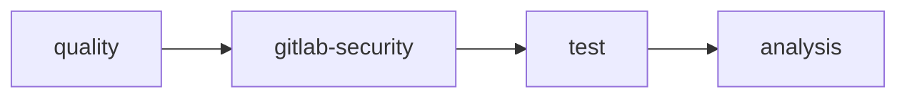

# CI/CD et qualité

Pipeline d'intégration continue, analyse de qualité et workflow de release
pour granit-front.

## Audience

- Développeur
- Ingénieur DevOps
- SRE

## Pipeline GitLab CI

Le pipeline est défini dans `.gitlab-ci.yml` et s'exécute sur les merge requests,
les branches `develop` et `main`, et les tags sémantiques (`v*.*.*`).

### Stages



| Stage | Jobs | Description |
| --- | --- | --- |
| **quality** | `lint`, `typecheck` | ESLint (0 warnings max) + TypeScript strict |
| **gitlab-security** | `secret_detection`, `sast`, `semgrep-sast` | Détection de secrets, SAST |
| **test** | `test` | Vitest avec couverture v8 |
| **analysis** | `audit:npm`, `sonarqube` | Audit des dépendances + SonarQube |

### Environnement d'exécution

| Paramètre | Valeur |
| --- | --- |
| Image | `node:24-bookworm-slim` |
| Gestionnaire de paquets | pnpm 10 (via corepack) |
| Cache | `.pnpm-store/` (clé : `pnpm-lock.yaml`) |
| Hooks Husky | Désactivés en CI (`HUSKY=0`) |

## Jobs détaillés

### Quality — `lint`

```bash
pnpm lint
```

ESLint avec `--max-warnings 0`. Aucun warning toléré.

Règles notables :
- `no-console` en erreur (sauf dans `@granit/logger`)
- `@typescript-eslint/consistent-type-imports` — `import type` obligatoire
- `import/order` — imports triés par groupe

### Quality — `typecheck`

```bash
pnpm tsc   # pnpm -r exec -- tsc --noEmit
```

TypeScript strict sur tous les packages. Vérifie :
- Pas de `any` implicite
- Pas de variables inutilisées
- Pas de paramètres inutilisés

### Security — Détection de secrets

Le template GitLab `Secret-Detection.gitlab-ci.yml` scanne le code à la recherche
de secrets en clair (tokens, mots de passe, clés API). **`allow_failure: false`** —
un secret détecté bloque la pipeline.

### Security — SAST

Analyse statique de sécurité via les templates GitLab `SAST.gitlab-ci.yml`
et Semgrep. **Semgrep est bloquant** (`allow_failure: false`).

### Test — `test`

```bash
pnpm test:coverage
```

Exécute Vitest en mode single-run avec couverture. Artefacts générés :

| Artefact | Durée de rétention | Usage |
| --- | --- | --- |
| `coverage/cobertura-coverage.xml` | 1 semaine | Widget de couverture dans les MR GitLab |
| `coverage/` (HTML + lcov) | 1 semaine | Consultation locale et SonarQube |

Le pattern de couverture `All files` est extrait pour l'affichage dans GitLab.

### Analysis — `audit:npm`

```bash
pnpm audit --audit-level moderate
```

Vérifie les vulnérabilités connues dans les dépendances (modérées et plus).
`allow_failure: true` — informatif, ne bloque pas la pipeline.

### Analysis — `sonarqube`

Analyse SonarQube conditionnelle — s'exécute uniquement si `SONAR_HOST_URL`
et `SONAR_TOKEN` sont définis dans les variables CI.

Configuration :
- **Sources** : `packages/`
- **Couverture** : `coverage/lcov.info`
- **Exclusions** : `**/*.test.ts`, `**/*.test.tsx`, `**/*.d.ts`
- `allow_failure: true`

## Workflow de branches

```mermaid
gitgraph
    commit id: "main"
    branch develop
    commit id: "feat: logger"
    branch feature/auth
    commit id: "feat: auth init"
    commit id: "feat: auth context"
    checkout develop
    merge feature/auth
    branch release/1.0
    commit id: "chore: version"
    checkout main
    merge release/1.0 tag: "v1.0.0"
    checkout develop
    merge release/1.0
```

| Branche | Rôle |
| --- | --- |
| `main` | Production — push direct interdit |
| `develop` | Intégration continue |
| `feature/*` | Développement de fonctionnalités |
| `release/*` | Préparation de release |
| `hotfix/*` | Correctifs urgents |

## Hooks de pré-commit

Les hooks Git locaux (via Husky) exécutent automatiquement :

| Hook | Commande |
| --- | --- |
| `pre-commit` | `pnpm lint && pnpm tsc` |
| `commit-msg` | `pnpm exec commitlint --edit` |

Les messages de commit suivent la convention [Conventional Commits](https://www.conventionalcommits.org/) :
`feat:`, `fix:`, `docs:`, `chore:`, `refactor:`, `test:`.

## Release

Les releases suivent le versioning sémantique (`vMAJOR.MINOR.PATCH`) :

1. Créer une branche `release/X.Y` depuis `develop`
2. Vérifier que la pipeline passe (lint + tsc + tests + security)
3. Merger dans `main` via MR (1 approbation minimum)
4. Taguer sur `main` : `vX.Y.Z`
5. Merger `main` dans `develop`

## Voir aussi

- [Tests](../testing/index.md) — conventions et patterns de test
- [Framework](../framework/index.md) — documentation de référence des modules
