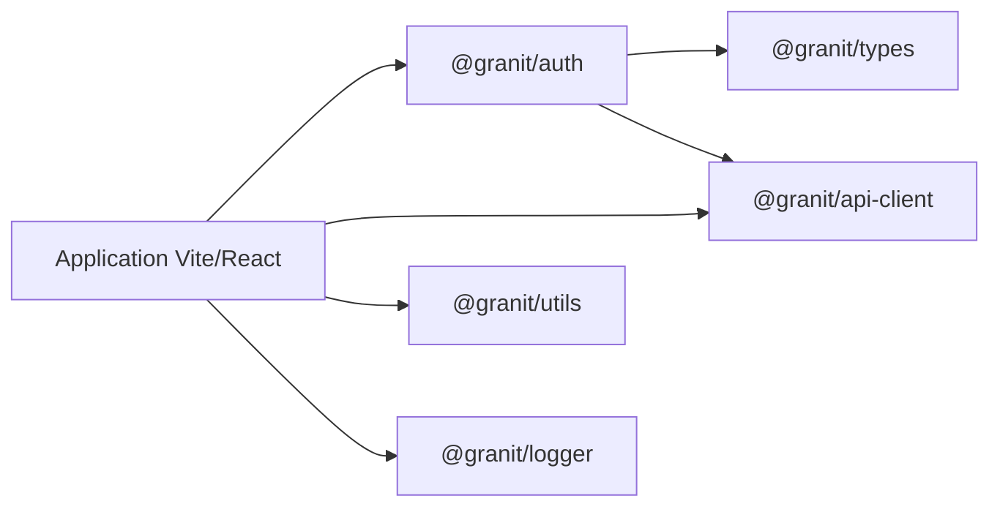

# Démarrage rapide

Ce guide montre comment intégrer granit-front dans une application Vite/React
existante. À la fin, l'application disposera d'un logger, d'un client HTTP
authentifié et d'un contexte d'authentification Keycloak typé.

## Architecture cible



## Étape 1 — Cloner le dépôt

Cloner `granit-front` à côté de l'application consommatrice :

```
workspace/
├── granit-front/          ← ce dépôt
└── mon-app/               ← application Vite/React
```

```bash
cd workspace
git clone git@gitlab.digitaldynamics.be:digital-dynamics/granit-front.git
cd granit-front && pnpm install
```

## Étape 2 — Déclarer les dépendances

Dans le `package.json` de l'application, ajouter les packages via le protocole `link:` :

```json
{
  "dependencies": {
    "@granit/logger":     "link:../granit-front/packages/@granit/logger",
    "@granit/types":      "link:../granit-front/packages/@granit/types",
    "@granit/utils":      "link:../granit-front/packages/@granit/utils",
    "@granit/api-client": "link:../granit-front/packages/@granit/api-client",
    "@granit/auth":       "link:../granit-front/packages/@granit/auth"
  }
}
```

Puis installer les peer dependencies requises :

```bash
pnpm add axios clsx tailwind-merge date-fns keycloak-js
```

## Étape 3 — Configurer Vite et TypeScript

### `vite.config.ts`

Ajouter les alias pour que Vite résolve directement les sources TypeScript :

```typescript
import path from 'path';
import { defineConfig } from 'vite';

const GRANIT = path.resolve(__dirname, '../granit-front/packages/@granit');

export default defineConfig({
  resolve: {
    alias: {
      '@granit/logger':     path.join(GRANIT, 'logger/src/index.ts'),
      '@granit/types':      path.join(GRANIT, 'types/src/index.ts'),
      '@granit/utils':      path.join(GRANIT, 'utils/src/index.ts'),
      '@granit/api-client': path.join(GRANIT, 'api-client/src/index.ts'),
      '@granit/auth':       path.join(GRANIT, 'auth/src/index.ts'),
    },
  },
});
```

### `tsconfig.json`

Ajouter les `paths` correspondants dans **chaque** tsconfig de l'application
(`tsconfig.app.json`, `tsconfig.test.json`, `tsconfig.storybook.json`) :

```json
{
  "compilerOptions": {
    "paths": {
      "@granit/logger":     ["../granit-front/packages/@granit/logger/src/index.ts"],
      "@granit/types":      ["../granit-front/packages/@granit/types/src/index.ts"],
      "@granit/utils":      ["../granit-front/packages/@granit/utils/src/index.ts"],
      "@granit/api-client": ["../granit-front/packages/@granit/api-client/src/index.ts"],
      "@granit/auth":       ["../granit-front/packages/@granit/auth/src/index.ts"]
    }
  }
}
```

## Étape 4 — Créer le logger et le client API

### `src/lib/logger.ts`

```typescript
import { createLogger } from '@granit/logger';

export const logger = createLogger('🛡️ [MonApp]');
```

### `src/lib/api.ts`

```typescript
import { createApiClient } from '@granit/api-client';

export const api = createApiClient({
  baseURL: import.meta.env.VITE_API_URL,
  timeout: 15_000,
});
```

Le Bearer token est automatiquement injecté par `@granit/auth` à l'étape suivante.

## Étape 5 — Configurer l'authentification Keycloak

### Définir le contexte d'authentification

```typescript
// src/auth/auth-context.ts
import { createAuthContext, type BaseAuthContextType } from '@granit/auth';

interface AuthContextType extends BaseAuthContextType {
  // Ajouter des champs spécifiques à l'application si besoin
}

export const { AuthContext, useAuth } = createAuthContext<AuthContextType>();
```

### Créer le provider

```typescript
// src/auth/AuthProvider.tsx
import { useKeycloakInit } from '@granit/auth';
import { AuthContext } from './auth-context';

export function AuthProvider({ children }: { children: React.ReactNode }) {
  const auth = useKeycloakInit({
    url:      import.meta.env.VITE_KEYCLOAK_URL,
    realm:    import.meta.env.VITE_KEYCLOAK_REALM,
    clientId: import.meta.env.VITE_KEYCLOAK_CLIENT_ID,
  });

  if (auth.loading) return <div>Chargement…</div>;

  return (
    <AuthContext.Provider value={auth}>
      {children}
    </AuthContext.Provider>
  );
}
```

### Intégrer dans l'application

```typescript
// src/main.tsx
import { AuthProvider } from './auth/AuthProvider';
import { App } from './App';

createRoot(document.getElementById('root')!).render(
  <AuthProvider>
    <App />
  </AuthProvider>
);
```

### Utiliser dans un composant

```typescript
import { useAuth } from './auth/auth-context';
import { logger } from '@/lib/logger';

function UserProfile() {
  const { user, logout } = useAuth();

  logger.info('Profil affiché', { userId: user?.sub });

  return (
    <div>
      <p>{user?.name}</p>
      <button onClick={logout}>Déconnexion</button>
    </div>
  );
}
```

## Vérification

```bash
# Vérifier que granit-front est sain
cd ../granit-front
pnpm lint && pnpm tsc && pnpm test run

# Lancer l'application
cd ../mon-app
pnpm dev
```

## Prochaines étapes

- [Documentation des modules](../framework/index.md) — référence détaillée de chaque package
- [Tests](../testing/index.md) — conventions et patterns de test
