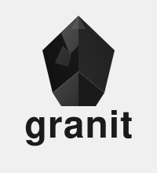

<p align="center">
  
</p>

# granit-front

Framework TypeScript/React partagé pour les applications front-end Digital Dynamics.

Granit-front fournit les briques communes à toutes les applications front-end :
logger configurable, types OIDC partagés, utilitaires Tailwind et formatage,
client HTTP Axios avec Bearer token, et couche d'authentification Keycloak.

Équivalent JavaScript/TypeScript de [`granit-dotnet`](https://gitlab.digitaldynamics.be/digital-dynamics/granit-dotnet).

## Stack technique

TypeScript 5 (strict) · React 19 · Vitest 3 · ESLint 9 · pnpm workspace · Node 24

## Packages

| Package | Rôle |
| --- | --- |
| [`@granit/logger`](framework/logger.md) | Factory de loggers configurables (`createLogger`) |
| [`@granit/types`](framework/types.md) | Types TypeScript partagés (`KeycloakUserInfo`, `PaginatedResponse`) |
| [`@granit/utils`](framework/utils.md) | Utilitaires partagés (`cn`, `formatDate`, `formatNumber`, …) |
| [`@granit/api-client`](framework/api-client.md) | Factory Axios avec intercepteur Bearer token |
| [`@granit/auth`](framework/auth.md) | Hooks Keycloak, factory de contexte auth, mock provider |

## Documentation

| Section | Description |
| --- | --- |
| [Framework](framework/index.md) | Documentation de référence de chaque module |
| [Guide](guide/index.md) | Tutoriels pas-à-pas, démarrage rapide |
| [Tests](testing/index.md) | Conventions, stack Vitest, patterns de mock, couverture |
| [CI/CD et qualité](deployment/index.md) | Pipeline GitLab CI, analyse de qualité, workflow de release |
| [Patterns](patterns/index.md) | 8 design patterns identifiés dans granit-front |

## Démarrage rapide

```bash
# Lint (0 warnings max)
pnpm lint

# TypeScript check (tous les packages)
pnpm tsc

# Tests — mode watch
pnpm test

# Couverture — v8 (lcov + html)
pnpm test:coverage
```

## Applications consommatrices

| Application | Dépôt |
| --- | --- |
| `guava-front` | `guava-platform/applications/guava-front` |
| `guava-admin` | `guava-platform/applications/guava-admin` |
