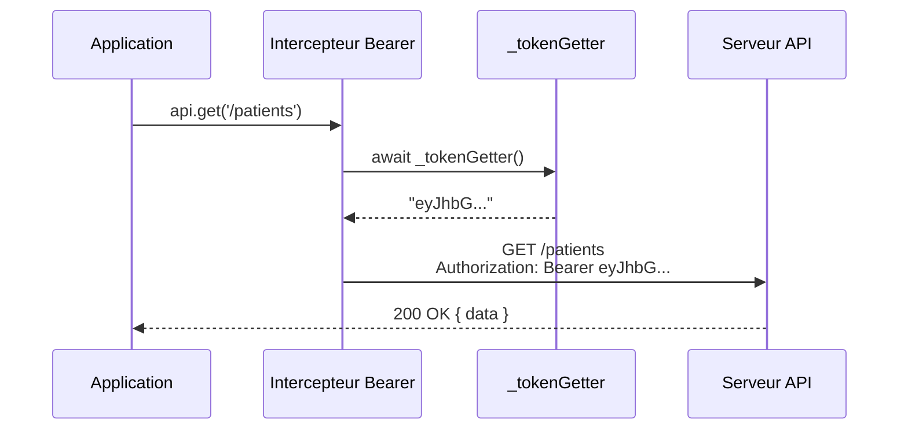
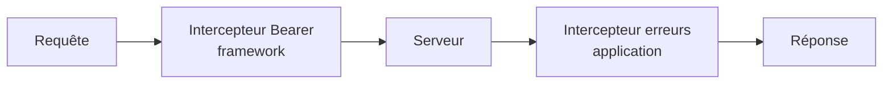

# Interceptor

## Définition

Le pattern Interceptor insère un traitement transparent dans un pipeline de
requêtes/réponses. Le code appelant n'a pas conscience de l'intercepteur — il
envoie une requête et reçoit une réponse comme si rien ne s'interposait.

## Schéma



## Implémentation dans Granit

| Intercepteur | Package | Type | Rôle |
| --- | --- | --- | --- |
| Bearer token | `@granit/api-client` | Requête | Injecter le header `Authorization` |

```typescript
instance.interceptors.request.use(async (req) => {
  if (_tokenGetter) {
    const token = await _tokenGetter();
    if (token) {
      req.headers.Authorization = `Bearer ${token}`;
    }
  }
  return req;
});
```

### Pipeline extensible

L'intercepteur framework gère uniquement le Bearer token. La gestion des erreurs
401/403 est intentionnellement laissée à l'application consommatrice, qui ajoute
son propre intercepteur de réponse :



## Justification

Injecter le token à chaque appel manuellement serait :

- **Répétitif** : chaque `api.get()` devrait passer le header
- **Fragile** : un oubli entraîne une 401
- **Couplé** : chaque appel connaîtrait la logique de token

L'intercepteur centralise ce comportement de manière transparente. Le framework
gère l'authentification, l'application gère ses erreurs métier.

## Exemple d'usage

```typescript
import { createApiClient } from '@granit/api-client';
import axios from 'axios';

const api = createApiClient({ baseURL: import.meta.env.VITE_API_URL });

// L'intercepteur Bearer est déjà en place — appels transparents
const { data } = await api.get('/patients');

// Ajouter un intercepteur applicatif pour les erreurs
api.interceptors.response.use(
  (response) => response,
  async (error: unknown) => {
    if (axios.isAxiosError(error) && error.response?.status === 401) {
      // Rediriger vers la page de login
      window.location.href = '/login';
    }
    throw error;
  },
);
```
