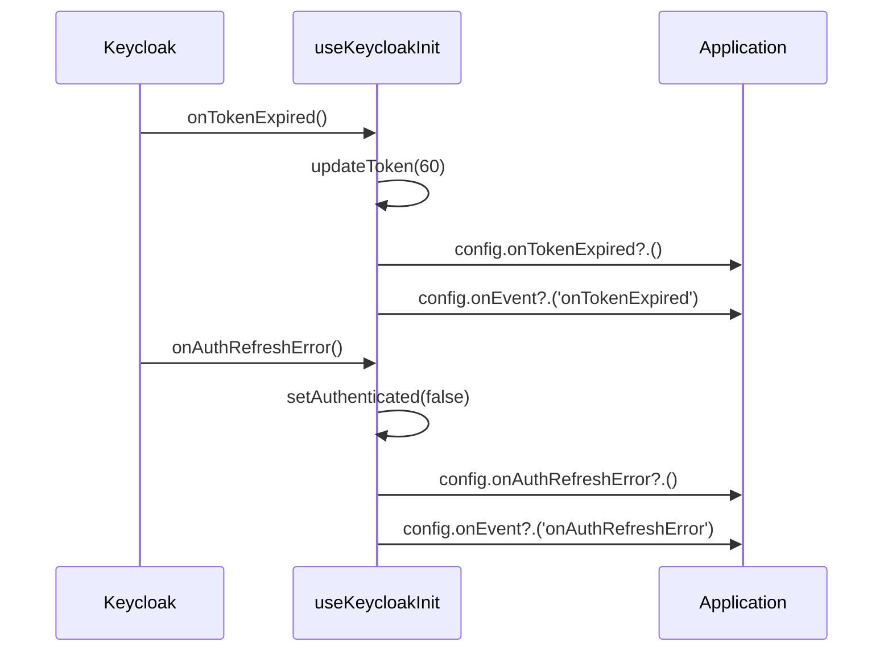

# Observer

## Définition

Le pattern Observer permet à un objet (le sujet) de notifier des abonnés lorsqu'un
événement se produit, sans couplage direct. Les abonnés réagissent à l'événement
selon leur propre logique.

## Schéma



## Implémentation dans Granit

| Sujet | Événements | Package |
| --- | --- | --- |
| `keycloak-js` | `onTokenExpired`, `onAuthRefreshError`, `onAuthLogout` | `@granit/auth` |

### Événements disponibles

```typescript
type KeycloakEvent =
  | 'onReady'
  | 'onAuthSuccess'
  | 'onAuthError'
  | 'onAuthRefreshSuccess'
  | 'onAuthRefreshError'
  | 'onAuthLogout'
  | 'onTokenExpired';
```

### Callbacks dans la configuration

```typescript
interface KeycloakCoreConfig {
  url: string;
  realm: string;
  clientId: string;
  // Observers spécifiques
  onTokenExpired?: () => void;
  onAuthRefreshError?: () => void;
  onAuthLogout?: () => void;
  // Observer générique
  onEvent?: (event: KeycloakEvent, error?: unknown) => void;
}
```

### Dispatch interne

Le hook intercepte les callbacks Keycloak natifs, applique un comportement par défaut
(renouvellement du token, mise à jour de l'état React), puis propage l'événement
vers l'application :

```typescript
keycloak.onTokenExpired = () => {
  keycloak.updateToken(60);       // Comportement framework
  config.onTokenExpired?.();      // Observer spécifique
  config.onEvent?.('onTokenExpired'); // Observer générique
};
```

## Justification

Le framework doit réagir aux événements Keycloak (renouveler le token, mettre à
jour l'état `authenticated`), mais l'application peut aussi avoir besoin d'agir :
afficher un toast, rediriger, enregistrer des métriques.

Le pattern Observer permet cette double réaction sans que l'application ne doive
surcharger ou remplacer le comportement du framework.

## Exemple d'usage

```typescript
import { useKeycloakInit } from '@granit/auth';

const auth = useKeycloakInit({
  url:      import.meta.env.VITE_KEYCLOAK_URL,
  realm:    import.meta.env.VITE_KEYCLOAK_REALM,
  clientId: import.meta.env.VITE_KEYCLOAK_CLIENT_ID,

  // Observer spécifique
  onTokenExpired: () => {
    logger.warn('Token expiré — renouvellement en cours');
  },

  // Observer générique — logging centralisé
  onEvent: (event, error) => {
    logger.debug('Keycloak event', { event, error });
  },
});
```
