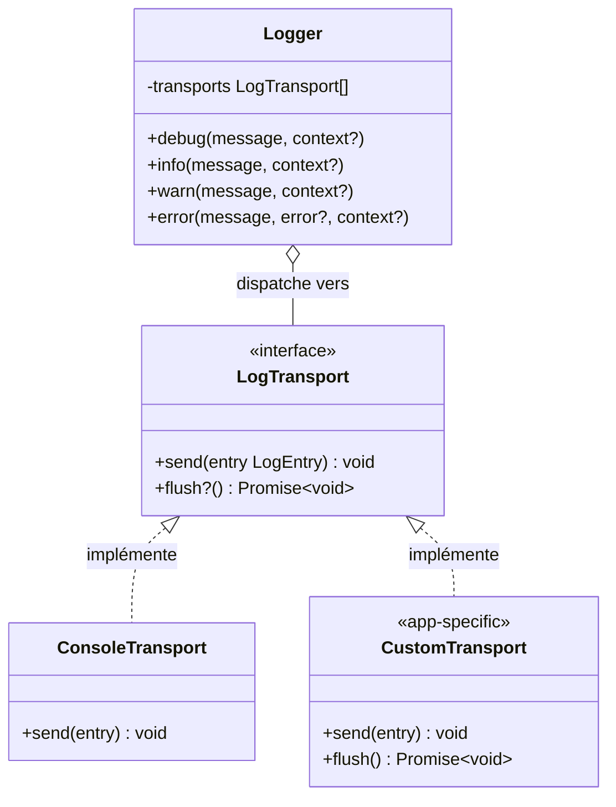

# Strategy

## Définition

Le pattern Strategy définit une famille d'algorithmes interchangeables derrière une
interface commune. Le contexte (ici le logger) délègue un comportement à un objet
stratégie sans connaître son implémentation concrète.

## Schéma



## Implémentation dans Granit

| Stratégie | Package | Fichier |
| --- | --- | --- |
| Interface `LogTransport` | `@granit/logger` | `src/index.ts` |
| `createConsoleTransport()` | `@granit/logger` | `src/index.ts` |

```typescript
export interface LogTransport {
  send(entry: LogEntry): void;
  flush?(): Promise<void>;
}
```

Le logger dispatche chaque entrée à tous les transports enregistrés :

```typescript
function dispatch(entry: LogEntry): void {
  for (const transport of transports) {
    transport.send(entry);
  }
}
```

### Transport par défaut

`createConsoleTransport()` formate les entrées avec des badges colorés en
développement et des messages simples en production.

### Flush au déchargement

Les transports avec une méthode `flush()` sont enregistrés dans un `Set` global
et vidés automatiquement lors de l'événement `beforeunload`.

## Justification

Le framework fournit un transport console adapté au développement, mais les
applications consommatrices peuvent avoir besoin de :

- Envoyer les logs vers un service distant (Sentry, Loki)
- Écrire dans un buffer pour les tests
- Filtrer ou transformer les entrées

L'interface `LogTransport` permet d'ajouter ces comportements sans modifier
le logger ni le framework.

## Exemple d'usage

```typescript
import { createLogger, createConsoleTransport } from '@granit/logger';
import type { LogTransport, LogEntry } from '@granit/logger';

// Transport custom — envoie les erreurs vers un service distant
const sentryTransport: LogTransport = {
  send(entry: LogEntry) {
    if (entry.level === 'ERROR') {
      Sentry.captureMessage(entry.message, {
        level: 'error',
        extra: entry.context,
      });
    }
  },
};

// Combiner les transports
const logger = createLogger('🛡️ [Guava]', {
  transports: [createConsoleTransport(), sentryTransport],
});

logger.error('Échec critique', new Error('timeout'));
// → Console + Sentry reçoivent tous les deux l'entrée
```
