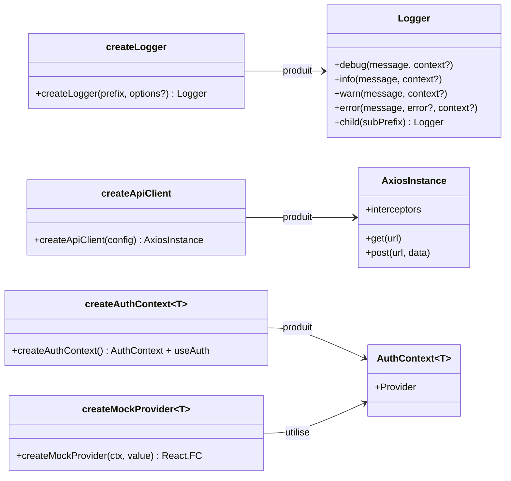

# Factory

## Définition

Le pattern Factory encapsule la logique de création d'objets complexes derrière une
fonction simple. L'appelant fournit une configuration minimale et reçoit une instance
prête à l'emploi, sans connaître les détails d'initialisation.

C'est le pattern dominant de granit-front : chaque package expose au moins une factory.

## Schéma



## Implémentation dans Granit

| Factory | Package | Entrée | Sortie |
| --- | --- | --- | --- |
| `createLogger` | `@granit/logger` | `prefix`, `options?` | `Logger` avec transports configurés |
| `createApiClient` | `@granit/api-client` | `ApiClientConfig` | `AxiosInstance` avec intercepteur Bearer |
| `createAuthContext<T>` | `@granit/auth` | — (générique) | `{ AuthContext, useAuth }` typés |
| `createMockProvider<T>` | `@granit/auth` | `AuthContext`, `value` | `React.FC` mock provider |

### Variante : factory générique

`createAuthContext<T extends BaseAuthContextType>()` est une factory paramétrée par
un type générique. Chaque application consommatrice fournit son propre type étendu,
et la factory retourne un contexte et un hook correctement typés.

## Justification

Les factories permettent de :

- **Masquer la complexité** : `createApiClient` configure Axios, enregistre
  l'intercepteur Bearer et applique les timeouts en une seule ligne
- **Garantir la cohérence** : toutes les instances de logger partagent le même
  format et les mêmes transports
- **Supporter l'extension typée** : `createAuthContext<T>` permet à chaque app
  d'ajouter des champs sans modifier le framework

## Exemple d'usage

```typescript
// Logger — une ligne suffit
import { createLogger } from '@granit/logger';
const logger = createLogger('🛡️ [Guava]');
logger.info('Application démarrée');

// Client HTTP — instance pré-configurée
import { createApiClient } from '@granit/api-client';
const api = createApiClient({ baseURL: import.meta.env.VITE_API_URL });

// Contexte auth — typé pour l'application
import { createAuthContext, type BaseAuthContextType } from '@granit/auth';
interface AuthContextType extends BaseAuthContextType {
  register: () => void;
}
export const { AuthContext, useAuth } = createAuthContext<AuthContextType>();
```
