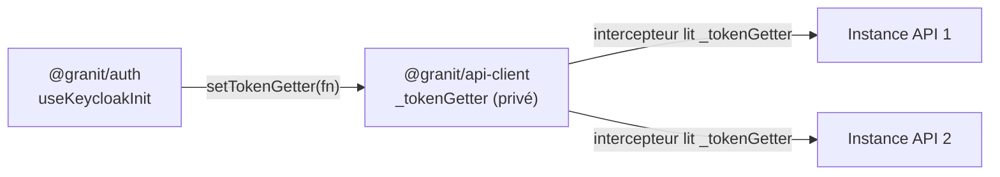

# Module Singleton

## Définition

Le Module Singleton exploite le mécanisme de cache des modules ES pour maintenir
un état global unique. Une variable privée au module est partagée par toutes les
instances qui importent le même package — sans class statique ni registre global.

## Schéma



## Implémentation dans Granit

| Singleton | Package | Fichier source |
| --- | --- | --- |
| `_tokenGetter` | `@granit/api-client` | `src/index.ts` |

```typescript
// Variable privée au module — une seule instance par application
let _tokenGetter: (() => Promise<string | undefined>) | null = null;

export function setTokenGetter(
  getter: () => Promise<string | undefined>,
): void {
  _tokenGetter = getter;
}
```

L'intercepteur Axios lit `_tokenGetter` à chaque requête :

```typescript
instance.interceptors.request.use(async (req) => {
  if (_tokenGetter) {
    const token = await _tokenGetter();
    if (token) {
      req.headers.Authorization = `Bearer ${token}`;
    }
  }
  return req;
});
```

## Justification

Le token Keycloak est géré par `@granit/auth`, mais consommé par `@granit/api-client`.
Le module singleton évite de coupler ces deux packages directement : `@granit/auth`
enregistre le getter une seule fois au démarrage, et toutes les instances Axios
en bénéficient automatiquement.

Alternative rejetée : passer le token en paramètre à chaque `createApiClient()` —
trop verbeux et impossible à synchroniser avec le renouvellement automatique.

## Exemple d'usage

```typescript
// Le wiring est automatique via useKeycloakInit — pas d'appel manuel nécessaire
import { useKeycloakInit } from '@granit/auth';

// useKeycloakInit appelle setTokenGetter() en interne
const auth = useKeycloakInit({ url, realm, clientId });

// Toute instance API injecte le token automatiquement
import { createApiClient } from '@granit/api-client';
const api = createApiClient({ baseURL: '/api' });
await api.get('/patients'); // → Authorization: Bearer <token>
```
