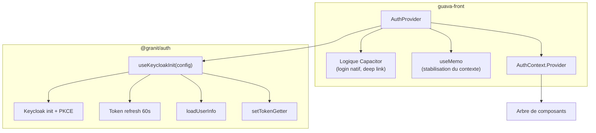

# Hook Composition

## Définition

Le pattern Hook Composition consiste à assembler des hooks bas niveau du framework
avec de la logique applicative dans un composant wrapper. Le hook framework fournit
le socle (authentification, état, lifecycle), et l'application ajoute sa couche
métier par-dessus.

## Schéma



## Implémentation dans Granit

| Couche | Responsabilité | Localisation |
| --- | --- | --- |
| Hook framework | Init Keycloak, PKCE, token refresh, état React | `@granit/auth` — `useKeycloakInit` |
| Provider applicatif | Extension métier, plateforme, mémoïsation | `guava-front` — `AuthProvider` |

### Hook framework (socle)

```typescript
// @granit/auth — fournit le socle commun
export function useKeycloakInit(config: KeycloakCoreConfig): KeycloakCoreResult {
  // Init unique, PKCE S256, check-sso
  // Token refresh automatique toutes les 60s
  // Wiring vers setTokenGetter()
  // État React : authenticated, loading, user
  return { keycloak, authenticated, loading, user, login, logout, register, ... };
}
```

### Provider applicatif (composition)

```typescript
// guava-front — compose le hook avec de la logique métier
function AuthProvider({ children }: { children: React.ReactNode }) {
  const {
    keycloak, keycloakRef, authenticated, loading, user,
    login: hookLogin, logout: hookLogout, register: hookRegister,
  } = useKeycloakInit(config);

  // Logique applicative ajoutée par composition
  const login = React.useCallback(async () => {
    if (isNative) {
      // Capacitor : ouvrir le navigateur système
      const url = keycloakRef.current?.createLoginUrl({ redirectUri });
      await Browser.open({ url });
    } else {
      hookLogin({ locale });
    }
  }, [isNative, keycloakRef, hookLogin]);

  // Stabilisation via useMemo
  const value = React.useMemo(
    () => ({ keycloak, authenticated, loading, user, login, logout, register }),
    [keycloak, authenticated, loading, user, login, logout, register],
  );

  return <AuthContext.Provider value={value}>{children}</AuthContext.Provider>;
}
```

## Justification

Le framework ne peut pas anticiper toutes les plateformes cibles (web, Capacitor,
Electron). Plutôt que d'ajouter des options à `useKeycloakInit` pour chaque cas,
le hook reste minimal et l'application compose par-dessus.

Ce pattern préserve :

- **Séparation des responsabilités** : le framework gère Keycloak, l'application
  gère sa plateforme
- **Pas de code app-spécifique** dans le framework : aucune logique Capacitor,
  aucun rôle admin, aucune URL custom
- **Testabilité** : le hook framework se teste isolément, le provider applicatif aussi

## Exemple d'usage

```typescript
// Application minimale (web uniquement) — composition simple
function AuthProvider({ children }: { children: React.ReactNode }) {
  const auth = useKeycloakInit({
    url:      import.meta.env.VITE_KEYCLOAK_URL,
    realm:    import.meta.env.VITE_KEYCLOAK_REALM,
    clientId: import.meta.env.VITE_KEYCLOAK_CLIENT_ID,
  });

  if (auth.loading) return <Spinner />;

  return (
    <AuthContext.Provider value={auth}>
      {children}
    </AuthContext.Provider>
  );
}

// Application avancée (Capacitor) — composition riche
function AuthProvider({ children }: { children: React.ReactNode }) {
  const { login: hookLogin, ...rest } = useKeycloakInit(config);

  const login = React.useCallback(async () => {
    if (Capacitor.isNativePlatform()) {
      await Browser.open({ url: buildKeycloakUrl() });
    } else {
      hookLogin();
    }
  }, [hookLogin]);

  return (
    <AuthContext.Provider value={{ ...rest, login }}>
      {children}
    </AuthContext.Provider>
  );
}
```
