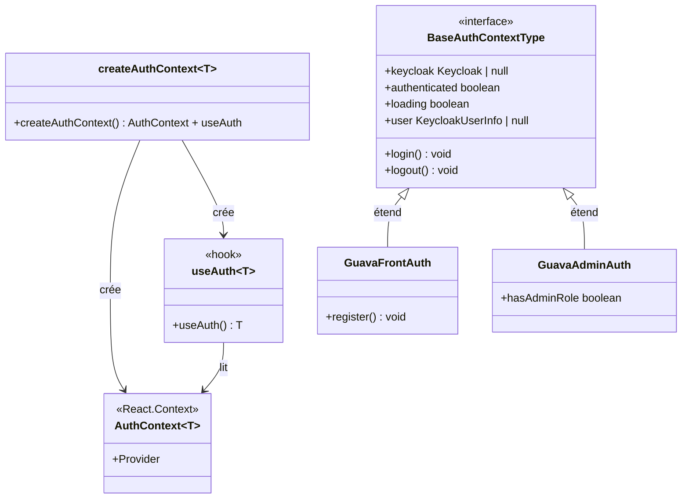

# Provider (React Context)

## Définition

Le pattern Provider utilise le mécanisme de Context de React pour injecter un état
partagé dans l'arbre de composants. Un composant haut niveau fournit la valeur,
et les composants descendants y accèdent via un hook — sans prop drilling.

Dans granit-front, ce pattern est combiné avec une factory générique pour permettre
à chaque application de typer son propre contexte d'authentification.

## Schéma



## Implémentation dans Granit

| Composant | Package | Fichier |
| --- | --- | --- |
| `createAuthContext<T>` | `@granit/auth` | `src/use-auth-context.ts` |
| `createMockProvider<T>` | `@granit/auth` | `src/mock-provider.tsx` |

### Factory de contexte

```typescript
export function createAuthContext<T extends BaseAuthContextType>() {
  const AuthContext = React.createContext<T | undefined>(undefined);

  function useAuth(): T {
    const context = React.useContext(AuthContext);
    if (!context) {
      throw new Error('useAuth must be used within an AuthContext.Provider');
    }
    return context;
  }

  return { AuthContext, useAuth };
}
```

### Guard d'utilisation

`useAuth()` lève une erreur explicite si appelé hors d'un `Provider`. Ce guard
empêche les bugs silencieux causés par un contexte `undefined`.

### Mock provider

`createMockProvider<T>()` produit un provider de test qui utilise le **même**
`AuthContext` que le provider réel — pas de double contexte à gérer.

## Justification

Chaque application (guava-front, guava-admin) a des champs d'authentification
différents (`register` vs `hasAdminRole`). Le framework ne peut pas définir un
type unique.

La factory générique résout ce problème : elle produit un `AuthContext` et un
`useAuth` correctement typés pour chaque application, tout en partageant la
même implémentation sous-jacente.

## Exemple d'usage

```typescript
// 1. Définir le type dans l'application
import { createAuthContext, type BaseAuthContextType } from '@granit/auth';

interface AuthContextType extends BaseAuthContextType {
  register: () => void;
}

export const { AuthContext, useAuth } = createAuthContext<AuthContextType>();

// 2. Fournir la valeur dans le provider
function AuthProvider({ children }: { children: React.ReactNode }) {
  const value: AuthContextType = { /* ... */ };
  return <AuthContext.Provider value={value}>{children}</AuthContext.Provider>;
}

// 3. Consommer dans un composant
function NavBar() {
  const { user, logout } = useAuth(); // ← typé AuthContextType
  return <button onClick={logout}>{user?.name}</button>;
}

// 4. Mock pour Storybook / tests
import { createMockProvider } from '@granit/auth';
const MockAuth = createMockProvider(AuthContext, {
  keycloak: null, authenticated: true, loading: false,
  user: { sub: '1', name: 'Test' },
  login: () => {}, logout: () => {}, register: () => {},
});
```
