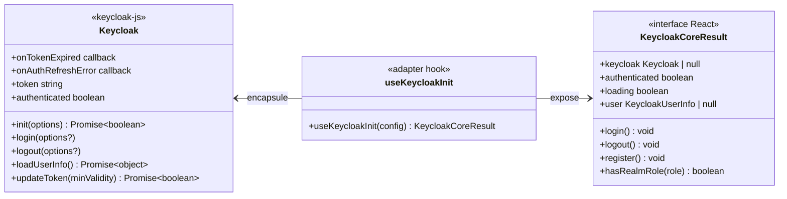

# Adapter

## Définition

Le pattern Adapter convertit l'interface d'une bibliothèque tierce en une interface
compatible avec le framework consommateur. Il isole le code applicatif des détails
d'implémentation de la librairie sous-jacente.

## Schéma



## Implémentation dans Granit

| Adaptateur | Package | Source | Cible |
| --- | --- | --- | --- |
| `useKeycloakInit` | `@granit/auth` | API `keycloak-js` (callbacks, promesses) | Hook React avec état typé |

### Transformations effectuées par l'adaptateur

| API Keycloak native | Interface adaptée |
| --- | --- |
| `keycloak.init({ onLoad, pkceMethod })` | Appel unique dans un `useEffect` avec garde `initStartedRef` |
| `keycloak.loadUserInfo()` → `Promise<object>` | `user: KeycloakUserInfo \| null` (état React typé) |
| `keycloak.onTokenExpired = callback` | Renouvellement automatique toutes les 60 secondes |
| `keycloak.token` (string mutable) | Wiring transparent vers `setTokenGetter()` |
| `keycloak.authenticated` (booléen mutable) | `authenticated: boolean` (état React réactif) |
| Init async en cours | `loading: boolean` (état React) |

## Justification

`keycloak-js` est conçu pour des applications vanilla JavaScript : callbacks mutables,
état interne non réactif, et initialisation impérative. Le hook adaptateur :

- **Rend l'état réactif** : `authenticated`, `loading`, `user` déclenchent des
  re-renders React automatiquement
- **Automatise le cycle de vie** : renouvellement du token, `check-sso`, rechargement
  des infos utilisateur — sans code applicatif
- **Découple la librairie** : si `keycloak-js` change son API, seul l'adaptateur
  est modifié — les apps consommatrices ne sont pas impactées

## Exemple d'usage

```typescript
import { useKeycloakInit } from '@granit/auth';

function AuthProvider({ children }: { children: React.ReactNode }) {
  // L'adaptateur masque toute la complexité Keycloak
  const { authenticated, loading, user, login, logout } = useKeycloakInit({
    url:      import.meta.env.VITE_KEYCLOAK_URL,
    realm:    import.meta.env.VITE_KEYCLOAK_REALM,
    clientId: import.meta.env.VITE_KEYCLOAK_CLIENT_ID,
  });

  if (loading) return <div>Chargement…</div>;
  if (!authenticated) {
    login();
    return null;
  }

  return <AuthContext.Provider value={{ authenticated, user, login, logout }}>
    {children}
  </AuthContext.Provider>;
}
```
